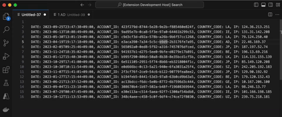

# Selection Processing Tools

Processing tools for selected text: select words, unique lines, sort lines, count occurrences...

## Features

Processing tools for selected text.

We currently offer fewer than 20 features, but we plan to add more gradually.

## Commands

| TITLE                                    | DESCRIPTION                                                     | ID                                                               |
| ---------------------------------------- | --------------------------------------------------------------- | ---------------------------------------------------------------- |
| Select Others (Match Case, Match Word)   | Select other text by multi cursor with Match Case, Match Word   | selection-processing-tools.select-others.match-case.match-word   |
| Select Others (Match Case, Ignore Word)  | Select other text by multi cursor with Match Case, Ignore Word  | selection-processing-tools.select-others.match-case.ignore-word  |
| Select Others (Ignore Case, Match Word)  | Select other text by multi cursor with Ignore Case, Match Word  | selection-processing-tools.select-others.ignore-case.match-word  |
| Select Others (Ignore Case, Ignore Word) | Select other text by multi cursor with Ignore Case, Ignore Word | selection-processing-tools.select-others.ignore-case.ignore-word |
| Extract Lines                            | Extract selected text to a new editor page                      | selection-processing-tools.extract                               |
| Reverse Lines                            | Reverse selected text to a new editor page                      | selection-processing-tools.reverse                               |
| Shuffle Lines                            | Shuffle selected text to a new editor page                      | selection-processing-tools.shuffle                               |
| Sort Lines Ascending by string           | Sort lines ascending by string to a new editor page             | selection-processing-tools.sort.string.ascending                 |
| Sort Lines Descending by string          | Sort lines descending by string to a new editor page            | selection-processing-tools.sort.string.descending                |
| Sort Lines Ascending by number           | Sort lines ascending by number to a new editor page             | selection-processing-tools.sort.number.ascending                 |
| Sort Lines Descending by number          | Sort lines descending by number to a new editor page            | selection-processing-tools.sort.number.descending                |
| Unique Lines                             | Unique selected text to a new editor page                       | selection-processing-tools.unique                                |
| Count Occurrences sorting by count       | Count occurrences sorting by count to a new editor page         | selection-processing-tools.count-occurrences.count               |
| Count Occurrences sorting by word        | Count occurrences sorting by word to a new editor page          | selection-processing-tools.count-occurrences.word                |
| Format JSON                              | Format JSON                                                     | selection-processing-tools.json.format                           |
| Minify JSON                              | Minify JSON                                                     | selection-processing-tools.json.minify                           |
| Parse JSON                               | Parse JSON                                                      | selection-processing-tools.json.parse                            |
| Stringify JSON                           | Stringify JSON                                                  | selection-processing-tools.json.stringify                        |
| Calculate Mathematical Expression        | Calculate Mathematical Expression                               | selection-processing-tools.calculation                           |
| to ISO 8601 or Timestamp                 | Convert to ISO 8601 or Timestamp from Timestamp or ISO 8601     | selection-processing-tools.calculation.date                      |

## Release Notes

### 0.0.2

Add transformer for JSON

### 0.0.1

Initial release
