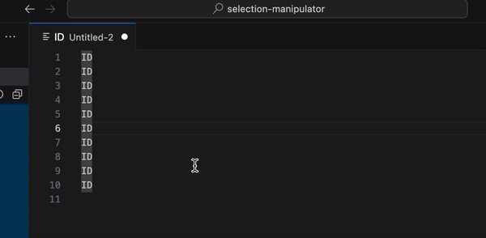
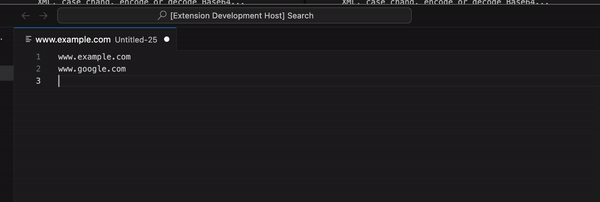

# Selection Manipulator

Processing tools for selected text: extract unique lines, sort lines, count occurrences, format JSON or XML, case chang, encode or decode Base64...

## Features

Processing tools for selected text.

We currently offer almost 60+ features, but we plan to add more gradually.

### sample - increment and zero padding

### sample - DNS

## Commands

| TITLE                                | DESCRIPTION                                                                          | ID                                            |
| ------------------------------------ | ------------------------------------------------------------------------------------ | --------------------------------------------- |
| Show Selection Manipulation Commands | Show Selection Manipulation Commands                                                 | selection-manipulator.show-commands           |
| Convert to Multi Selection           | Convert to multi selections (cursors) from single selection                          | selection-manipulator.multi-selection         |
| Extract Lines                        | Extract selected text to a new editor page                                           | selection-manipulator.extract                 |
| Extract Lines exclude Blank Rows     | Extract selected text to exclude blank rows to a new editor page                     | selection-manipulator.extract                 |
| Unique Lines                         | Unique selected text to a new editor page                                            | selection-manipulator.unique                  |
| Reverse Lines                        | Reverse selected text to a new editor page                                           | selection-manipulator.reverse                 |
| Shuffle Lines                        | Shuffle selected text to a new editor page                                           | selection-manipulator.shuffle                 |
| Sort Lines Ascending by string       | Sort lines ascending by string to a new editor page                                  | selection-manipulator.sort.string.ascending   |
| Sort Lines Descending by string      | Sort lines descending by string to a new editor page                                 | selection-manipulator.sort.string.descending  |
| Sort Lines Ascending by number       | Sort lines ascending by number to a new editor page                                  | selection-manipulator.sort.number.ascending   |
| Sort Lines Descending by number      | Sort lines descending by number to a new editor page                                 | selection-manipulator.sort.number.descending  |
| Format JSON                          | Format JSON to a new editor page                                                     | selection-manipulator.json.format             |
| Minify JSON                          | Minify JSON to a new editor page                                                     | selection-manipulator.json.minify             |
| Parse JSON                           | Parse JSON to a new editor page                                                      | selection-manipulator.json.parse              |
| Stringify JSON                       | Stringify JSON to a new editor page                                                  | selection-manipulator.json.stringify          |
| Format XML                           | Format XML to a new editor page                                                      | selection-manipulator.xml.format              |
| Minify XML                           | Minify XML to a new editor page                                                      | selection-manipulator.xml.minify              |
| Encode Base64                        | Encode Base64 to a new editor page                                                   | selection-manipulator.base64.encode           |
| Decode Base64                        | Decode Base64 to a new editor page                                                   | selection-manipulator.base64.decode           |
| Deflate Base64                       | Deflate Base64 to a new editor page                                                  | selection-manipulator.base64.deflate          |
| Inflate Base64                       | Inflate Base64 to a new editor page                                                  | selection-manipulator.base64.inflate          |
| Resolve A DNS Record                 | Resolve A DNS Record to a new editor page                                            | selection-manipulator.dns.a                   |
| Resolve AAAA DNS Record              | Resolve AAAA DNS Record to a new editor page                                         | selection-manipulator.dns.aaaa                |
| Resolve ANY DNS Record               | Resolve ANY DNS Record to a new editor page                                          | selection-manipulator.dns.any                 |
| Resolve CAA DNS Record               | Resolve CAA DNS Record to a new editor page                                          | selection-manipulator.dns.caa                 |
| Resolve CNAME DNS Record             | Resolve CNAME DNS Record to a new editor page                                        | selection-manipulator.dns.cname               |
| Resolve MX DNS Record                | Resolve MX DNS Record to a new editor page                                           | selection-manipulator.dns.mx                  |
| Resolve NAPTR DNS Record             | Resolve NAPTR DNS Record to a new editor page                                        | selection-manipulator.dns.naptr               |
| Resolve NS DNS Record                | Resolve NS DNS Record to a new editor page                                           | selection-manipulator.dns.ns                  |
| Resolve PTR DNS Record               | Resolve PTR DNS Record to a new editor page                                          | selection-manipulator.dns.ptr                 |
| Resolve SOA DNS Record               | Resolve SOA DNS Record to a new editor page                                          | selection-manipulator.dns.soa                 |
| Resolve SRV DNS Record               | Resolve SRV DNS Record to a new editor page                                          | selection-manipulator.dns.srv                 |
| Resolve TXT DNS Record               | Resolve TXT DNS Record to a new editor page                                          | selection-manipulator.dns.txt                 |
| Resolve REVERSE DNS Record           | Resolve REVERSE DNS Record to a new editor page                                      | selection-manipulator.dns.reverse             |
| Count Occurrences sorting by count   | Count occurrences sorting by count to a new editor page                              | selection-manipulator.count-occurrences.count |
| Count Occurrences sorting by word    | Count occurrences sorting by word to a new editor page                               | selection-manipulator.count-occurrences.word  |
| Count Up to List                     | Count up number and make list to a new editor page                                   | selection-manipulator.count-up-list           |
| Change Case Camel                    | Change Case Camel                                                                    | selection-manipulator.case.camel              |
| Change Case Capital                  | Change Case Capital                                                                  | selection-manipulator.case.capital            |
| Change Case Constant                 | Change Case Constant                                                                 | selection-manipulator.case.constant           |
| Change Case Dot                      | Change Case Dot                                                                      | selection-manipulator.case.dot                |
| Change Case Kebab                    | Change Case Kebab                                                                    | selection-manipulator.case.kebab              |
| Change Case No                       | Change Case No                                                                       | selection-manipulator.case.no                 |
| Change Case Pascal                   | Change Case Pascal                                                                   | selection-manipulator.case.pascal             |
| Change Case Path                     | Change Case Path                                                                     | selection-manipulator.case.path               |
| Change Case Sentence                 | Change Case Sentence                                                                 | selection-manipulator.case.sentence           |
| Change Case Snake                    | Change Case Snake                                                                    | selection-manipulator.case.snake              |
| Change Case Train                    | Change Case Train                                                                    | selection-manipulator.case.train              |
| Change Case Upper                    | Change Case Upper                                                                    | selection-manipulator.case.upper              |
| Change Case Lower                    | Change Case Lower                                                                    | selection-manipulator.case.lower              |
| Zero Padding                         | Zero padding to a new editor page                                                    | selection-manipulator.zero-padding            |
| Increment from 1                     | Increment from 1                                                                     | selection-manipulator.increment-from-1        |
| Increment from N                     | Increment from N                                                                     | selection-manipulator.increment-from-n        |
| Decrement to 1                       | Decrement to 1                                                                       | selection-manipulator.decrement-to-1          |
| Decrement to N                       | Decrement to N                                                                       | selection-manipulator.decrement-to-n          |
| Increment by 1                       | Increment by 1                                                                       | selection-manipulator.increment-by-1          |
| Increment by N                       | Increment by N                                                                       | selection-manipulator.increment-by-n          |
| Decrement by 1                       | Decrement by 1                                                                       | selection-manipulator.decrement-by-1          |
| Decrement by N                       | Decrement by N                                                                       | selection-manipulator.decrement-by-n          |
| Calculate Mathematical Expression    | Calculate Mathematical Expression to a new editor page                               | selection-manipulator.calculation             |
| Transform to Timestamp and ISO 8601  | Convert to timestamp and ISO 8601 from timestamp or date format to a new editor page | selection-manipulator.calculation.date        |
| Regular Expression (/PATTERN/g)      | Regular Expression to a new editor page (/PATTERN/g)                                 | selection-manipulator.regex.g                 |
| Regular Expression (/PATTERN/gi)     | Regular Expression to a new editor page (/PATTERN/gi)                                | selection-manipulator.regex.gi                |

## Release Notes

## 0.0.6

- 💄 Commands that cannot be used in multiple selection mode are now hidden
- 💄 In base64, only single selection is allowed

## 0.0.5

- 🐛 Fix Case tools to work
- ✨ Add tool to show command list at command pallet
- ✨ Add tools for DNS
- 💄 Change zero padding behavior to replace
- 💄 Open a new document in the beside column only when the first column is operated
- 💄 Change regex title decoration
- 💄 Change calculation output format

## 0.0.4

- 💥 Remove select others tools (instead use ⇧⌘L)
- ✨ Add xml format tools
- ✨ Add tool converting multi selections from single selection
- ✨ Add tool extracting lines exclude blank rows
- ✨ Add tool to count up and make list
- ✨ Add zero padding tool
- ✨ Add add tools for increment from and decrement to
- ✨ Add add tools for increment by and decrement by
- ✨ Add add tools for case change
- 🎨 Change output format for date calculation

## 0.0.3

- ✨ Add base64 tools
- ✨ Add regex check tool
- 💄 Change to open editor beside
- 💄 Change application name

### 0.0.2

- ✨ Add transformer for JSON

### 0.0.1

- 🎉 Initial release
